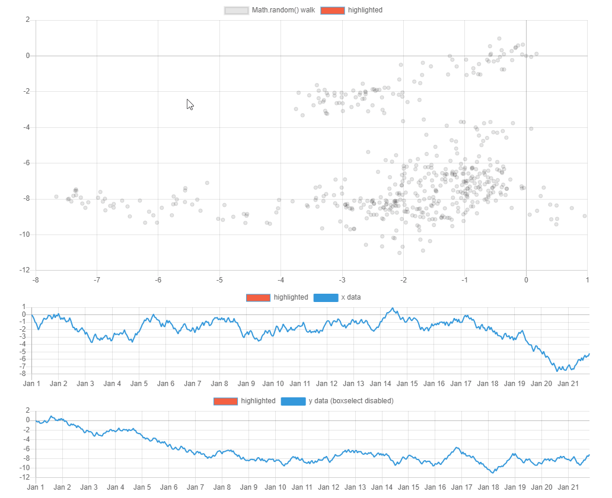

# chartjs-plugin-boxselect


A [Chart.js](https://www.chartjs.org) plugin to select points using click-and-drag boxes.  
Works with `scatter` and `line` chart types.

## Installation
To install with npm
```
npm install --save chartjs-plugin-boxselect
```
To use with a `<script>` tag
```
<script src="https://cdn.jsdelivr.net/npm/chart.js@2.9.4"></script>
<script src="https://cdn.jsdelivr.net/npm/chartjs-plugin-boxselect@1.0.3"></script>
```

## Configuration
To configure the box-select plugin, add a new config option to a chart config.
```javascript
plugins: {
    boxselect: {
        select: {
            enabled: true
        },
        callbacks: {
            beforeSelect: function(startX, endX, startY, endY) {
                // return false to cancel selection
                return true;
            }
            afterSelect: function(startX, endX, startY, endY, datasets) {

            }
        }
    },
}
```
The `datasets` parameter in the `afterSelect` callback is the same size as the array of datasets in the chart.   
Each ```dataset``` has the parameters `data`, `labels`, and `indexes`.  
`data` contains an array of points that fell inside the selection box.  
`indexes` contains the corresponding index of each point that was selected from the original `dataset.data`
`labels` contains the labels (if any) from the dataset that correspond to the selected points.  

## Samples
A sample chart that shows how the `afterSelect` callback can be used to highlight data is in the /samples directory.


## Development
[rollup](https://rollupjs.org/) is required to build.  
The built `boxselect.js` file is in the `/dist` directory.  
The build command is `npm run build`.

## Credits
Created by [Thomas Humphries](https://github.com/TomHumphries).  
Code inspired by [chartjs-plugin-crosshair](https://github.com/AbelHeinsbroek/chartjs-plugin-crosshair) and [chartjs-plugin-zoom](https://github.com/chartjs/chartjs-plugin-zoom).

## Licence
chartjs-plugin-boxselect.js is available under the [MIT licence](https://opensource.org/licenses/MIT).
